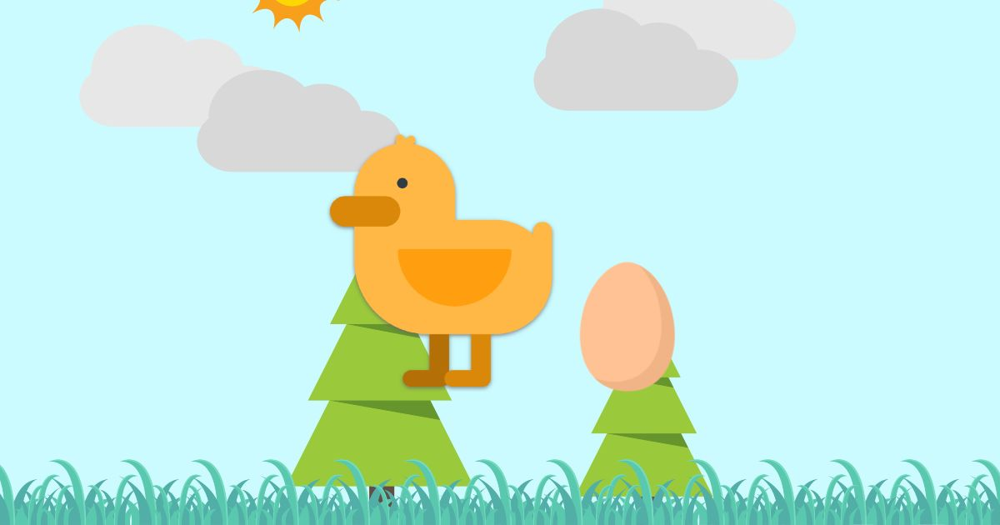

# Duck Game

Welcome to my stupid little **Duck Game** project.  This project was mostly for me to hone some more skills with javascript, and it actually ended up being a ton of fun. As I let friends give a try, I got lots of suggestions. Which only means I can keep learning and making fun stuff.

This is a fun and interactive webpage where a little ducky follows your mouse, mini ducks wander around, and a bird occasionally flies across the screen. The project is hosted [here](https://duck.twade.io/).

I host this on Netlify, which automatically detects source control changes and publishes them to a CDN. Pretty fantastic.

[](https://app.netlify.com/sites/twadeio-duck/deploys)

## Table of Contents
- [Features](#features)
- [Demo](#demo)
- [Installation](#installation)
- [Usage](#usage)
- [Technologies](#technologies)
- [License](#license)

## Features
- **Mouse Following Duck**: A main duck that follows the cursor around the screen.
- **Wandering Mini Ducks**: Mini ducks that follow the main duck and randomly wander when idle.
- **Egg Collection**: Randomly placed eggs that can be collected by the user.
- **Flying Bird**: A bird that flies across the screen every 15-20 seconds, accompanied by a sound.
- **Background Music**: Continuous background music that can be controlled by a volume slider.
- **Sound Effects**: Sounds that play when eggs are collected and when the bird flies across the screen.

## Demo
You can see the Duck Game project in action [here](https://duck.twade.io/).

## Installation
If you want to mess with things a bit on your own and play a bit.

1. **Clone the repository**:
    ```bash
    git clone https://github.com/travisnwade/duck-game.git
    ```

2. **Navigate to the project directory**:
    ```bash
    cd duck-game
    ```

3. **Deploy to Netlify or your favorite hosting provider**

## Usage
Once the project is running, you can interact with the duck that follows your mouse cursor. Mini ducks will also follow the main duck and wander around randomly. Collect the eggs by moving your cursor over them to increase the egg count. Enjoy the bird flying across the screen with accompanying sound effects and background music.

### Controls
- **Volume Control**: Use the volume slider at the bottom right corner to adjust the background music volume.

## Technologies
- **HTML**: Structure of the webpage.
- **CSS**: Styling of the webpage.
- **JavaScript**: Interactivity and animations.
- **Google Fonts**: For custom font styling.
- **Audio Elements**: For background music and sound effects.

## License
This project is licensed under the MIT License. See [License](LICENSE) for more details.

---

Created by Travis Wade. Visit the [repository](https://github.com/travisnwade/duck-game) for more information.
